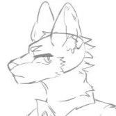

## Latest Update

Check my [2024](2024.md) Summary now!

---

## About Me

So here's yardrat's handsome headshot~~~

I guess you must be no less confused than me, wondering that how can yardrat be such a dog (~~or what ever, especially when both his and the file's name indicates 'rat'~~), and here comes why (along with some fun facts about yardrat himself): 

- Why the name “YardRat”?
You might be thinking, "How can a 'Rat' be a 'Dog'?" Honestly, I don’t remember the exact reason for choosing the name "YardRat" during my junior high years, but it’s just stuck with me ever since. One reason I chose it, though, is because the abbreviation of "YardRat" is the same as my real name. And don't you think that 'a rat exploring a yard' suits a undergrad freshman figure? 

- How did I get into the furry fandom?
Well, it was during my junior high years when I first came across some furry-related media. It was like a gateway into a whole new world, and somehow, I found myself deep within the furry fandom. How did it happen? I can’t pinpoint the moment, but it just felt right. If you’re wondering how others find themselves in this fandom, I recommend checking out [Furscience](https://furscience.com) for some insightful articles!

This 'fun fact' list would be updated later on, as once I come up something fun and worth writing about~ :)

---

## Links

- [XyX](https://xuan-insr.github.io) "Bald head gluttonous office drone"
- [Ebisu](https://inuebisu.cn) "A puppy that would be delighted by your visit"
