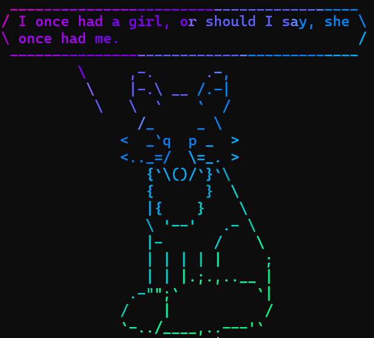

## `Alt+IJKL` for rebinding arrows

- I've borrowed this idea from the `vim` editor
- Although `vim` itself seems quite bothering for beginners(such as myself), its 'keyboard first' idea still sounds good
- For my Windows environment, I've been using 'Lenovo Hotkeys' for key-rebindings
- Besides, it should be possible for some editors to rebind keys in their configuration file, such as my `micro` editor in my debian environment.

## `Win+R` for keyboard-based application launching

- Step 1: build a folder 'Shortcut' (or whatever name you prefer) on the `desktop` (or wherever you prefer), and add it to the `PATH` environment variable
- Step 2: fill the folder with those frequently-used applications' shortcuts
- Step 3: all is done, and you can use `Win+R` to launch these links :>

## `Roll`

- To be honest, it's not something about improving tech effeciency, but it is really fun.
- It's a package I designed, which generates fun things like this:

- Just download it [here](../source/roll.tar.gz), and customize it~
- P.S. I forgot to write a `readme.md` document for it, but just read its source code and you'll understand how things work
